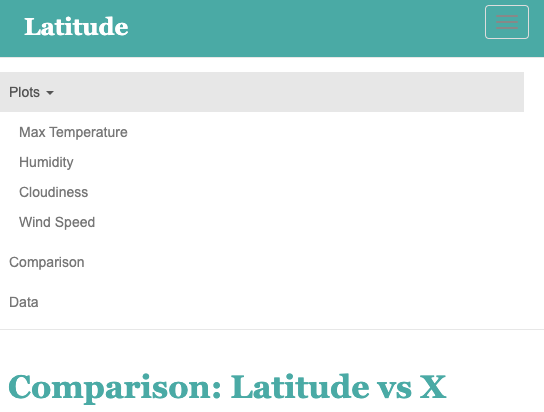

# Web Design - Web Visualization Dashboard (Latitude)

The purpose of this project was to analyze how weather changes as you get closer to the equator. To accomplish this analysis, we first pulled data from the OpenWeatherMap API to assemble a dataset on over 500 cities.
After assembling the dataset, we used Matplotlib to plot various aspects of the weather vs. latitude. Factors we looked at included: temperature, cloudiness, wind speed, and humidity. This site provides the souce data and visualizations created as part of the analysis, as well as explanations and descriptions of any trends and correlations witnessed.

As expected, the weather becomes significantaly warmer as one approaches the equator (Deg. Latitude). More interestingly, however, is the fact that the southern hemisphere tends to be warmer this time of the year than the northern hemisphere. This may be due to the tilt of the earth at the time of the year this data was gathered.

Humidity does not show positive correlation to latitude. There is not so much relation between humidity and latitude.

The plots, couldiness vs Latitude, does not show any trend. Cloudiness does not increase or decrease when latitude gets closer to the equator. Clouds likely form in abundance in the middle latitudes.

This plot shows that there is no trend or correlation between latitude and wind speed, as we get closet to the equator. Although the data suggests that there is higher wind speed when cities move further away the equator, we need more density of points to show the relation

## Background

Data is more powerful when we share it with others! Let's take what we've learned about HTML and CSS to create a dashboard showing off the analysis we've done.

### Before You Begin

1. Create a new repository for this project called `Web-Design-Challenge`. **Do not add this homework to an existing repository**.

2. Clone the new repository to your computer.

3. Inside your local git repository, create a directory for the web challenge. Use a folder name to correspond to the challenge: **WebVisualizations**.

4. Add your **html** files to this folder as well as your **assets**, **Resources** and **visualizations** folders.

5. Push the above changes to GitHub or GitLab.

6. Deploy to GitHub pages. 

## Latitude - Latitude Analysis Dashboard with Attitude

For this homework we'll be creating a visualization dashboard website using visualizations we've created in a past assignment. Specifically, we'll be plotting [weather data](Resources/cities.csv).

In building this dashboard, we'll create individual pages for each plot and a means by which we can navigate between them. These pages will contain the visualizations and their corresponding explanations. We'll also have a landing page, a page where we can see a comparison of all of the plots, and another page where we can view the data used to build them.

### Website Requirements

For reference, see the ["Screenshots" section](#screenshots) below.

The website must consist of 7 pages total, including:

* A [landing page](#landing-page) containing:
  * An explanation of the project.
  * Links to each visualizations page. There should be a sidebar containing preview images of each plot, and clicking an image should take the user to that visualization.
* Four [visualization pages](#visualization-pages), each with:
  * A descriptive title and heading tag.
  * The plot/visualization itself for the selected comparison.
  * A paragraph describing the plot and its significance.
* A ["Comparisons" page](#comparisons-page) that:
  * Contains all of the visualizations on the same page so we can easily visually compare them.
  * Uses a Bootstrap grid for the visualizations.
    * The grid must be two visualizations across on screens medium and larger, and 1 across on extra-small and small screens.
* A ["Data" page](#data-page) that:
  * Displays a responsive table containing the data used in the visualizations.
    * The table must be a bootstrap table component. [Hint](https://getbootstrap.com/docs/4.3/content/tables/#responsive-tables)
    * The data must come from exporting the `.csv` file as HTML, or converting it to HTML. Try using a tool you already know, pandas. Pandas has a nifty method approprately called `to_html` that allows you to generate a HTML table from a pandas dataframe. See the documentation [here](https://pandas.pydata.org/pandas-docs/version/0.17.0/generated/pandas.DataFrame.to_html.html)

The website must, at the top of every page, have a navigation menu that:

* Has the name of the site on the left of the nav which allows users to return to the landing page from any page.
* Contains a dropdown menu on the right of the navbar named "Plots" that provides a link to each individual visualization page.
* Provides two more text links on the right: "Comparisons," which links to the comparisons page, and "Data," which links to the data page.
* Is responsive (using media queries). The nav must have similar behavior as the screenshots ["Navigation Menu" section](#navigation-menu) (notice the background color change).

Finally, the website must be deployed to GitHub pages.

When finished, submit to BootcampSpot the links to 1) the deployed app and 2) the GitHub repository.

### Considerations

* You may use the [weather data](Resources/cities.csv) or choose another dataset. Alternatively, you may use the included [cities dataset](Resources/cities.csv) and pull the images from the [assets folder](Resources/assets).
* You must use Bootstrap. This includes using the Bootstrap `navbar` component for the header on every page, the bootstrap table component for the data page, and the Bootstrap grid for responsiveness on the comparison page.
* You must deploy your website to GitHub pages, with the website working on a live, publicly accessible URL as a result.
* Be sure to use a CSS media query for the navigation menu.
* Be sure your website works at all window widths/sizes.
* Feel free to take some liberty in the visual aspects, but keep the core functionality the same.

### Bonuses

* Use a different dataset! The requirements above still hold, but make it your own.
* Use a Bootstrap theme to customize your website. You may use a tool like [Bootswatch](https://bootswatch.com/). Make it look snazzy, give it some attitude. If using this, be sure you also meet all of the requirements listed above.
* Add extra visualizations! The more comparisons the better, right?
* Use meaningful glyphicons next to links in the header.
* Have visualization navigation on every visualizations page with an active state. See the screenshots below.

### Screenshots

This section contains screenshots of each page that must be built, at varying screen widths. These are a guide; you can meet the requirements without having the pages look exactly like the below images.

#### Landing page

Large screen:

Small screen:



#### Comparisons page

Large screen:

Small screen:

#### Data page

Large screen:

Small screen:

#### Visualization pages

You'll build four of these, one for each visualization. Here's an example of one:

Large screen:

Small screen:

#### Navigation menu

Large screen:

Small screen:

### Copyright

Trilogy Education Services © 2019. All Rights Reserved.
